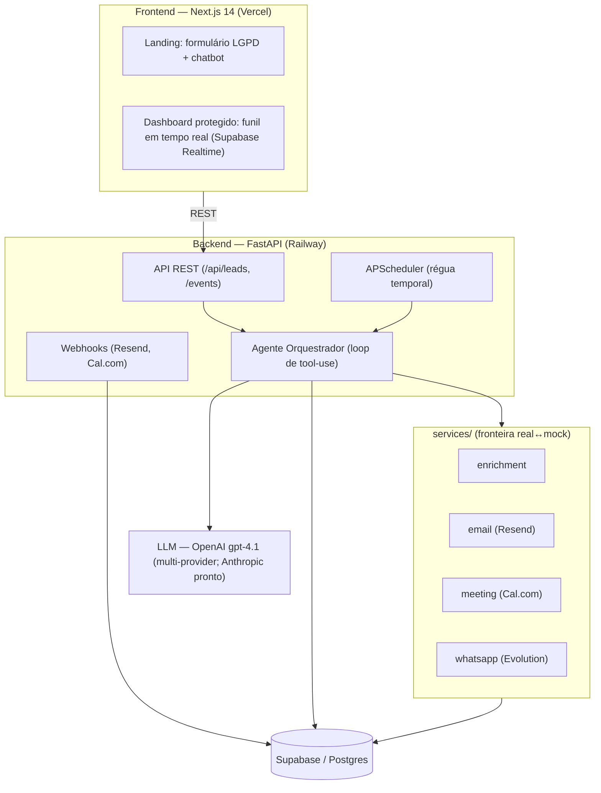
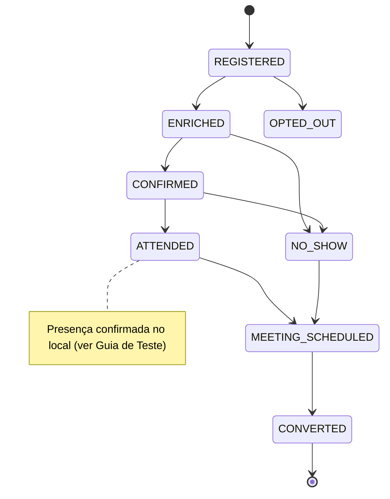

# Documentação do Projeto no Notion — Implementation Plan

> **For agentic workers:** REQUIRED SUB-SKILL: Use superpowers:subagent-driven-development or superpowers:executing-plans. Esta é uma tarefa de **geração de conteúdo via MCP do Notion** (não código com pytest) — cada task cria uma página e a verifica via `notion-fetch`. Recomenda-se execução **inline** (o conteúdo exige contexto rico do projeto e julgamento editorial).

**Goal:** Publicar no Notion uma documentação hub + 8 sub-páginas (PT-BR) que cobre os 6 entregáveis do case + como rodar + guia de teste/demo, compartilhável via link.

**Architecture:** `notion-create-pages` cria a página-mãe sob a página Vigil-Ai (`3727dbb3ad7d8069bdebe7a00b652136`); captura-se o ID retornado; cada sub-página é criada com `parent.page_id` = ID da mãe e `content` em Notion-Markdown. Verificação por `notion-fetch`. Diagramas em code blocks `mermaid`.

**Tech Stack:** MCP do Notion (`notion-create-pages`, `notion-fetch`, `notion-update-page`), Notion-flavored Markdown.

**Spec:** `docs/superpowers/specs/2026-06-01-notion-documentation-design.md`

**Fatos verificados no código (usar exatos):**
- Funil (`state_machine.py`): REGISTERED→{ENRICHED,OPTED_OUT}; ENRICHED→{CONFIRMED,NO_SHOW,OPTED_OUT}; CONFIRMED→{ATTENDED,NO_SHOW,OPTED_OUT}; ATTENDED→{MEETING_SCHEDULED,OPTED_OUT}; NO_SHOW→{MEETING_SCHEDULED,OPTED_OUT}; MEETING_SCHEDULED→{CONVERTED,OPTED_OUT}; CONVERTED→{OPTED_OUT}.
- Migrações: `backend/migrations/001_initial.sql`, `002_security_definer_rpcs.sql`; `backend/scripts/migrations/001_audit_remediation.sql`, `002_reaudit.sql`, `003_demo_mode.sql`, `004_fix_stage_transition_enum_cast.sql`.
- `docker-compose.yml` existe na raiz.
- LLM ativo: OpenAI (gpt-4.1) via `OPENAI_API_KEY`; multi-provider em `llm/provider.py` (Anthropic preferido). Mocks: Apollo/Cal.com/Evolution ativam mock se a chave estiver vazia. Email (Resend) e LLM sempre reais.
- Prod: frontend `paulolinder.com.br`; backend Railway (redeploy manual); banco Supabase ref `lgpfityloozdveqopjof`.

---

## Task 0: Preparação — ler o spec de Markdown do Notion e a página pai

- [ ] **Step 1: Buscar a spec de Markdown do Notion**

Fetch do recurso MCP `notion://docs/enhanced-markdown-spec` (via `ReadMcpResourceTool` ou `notion-fetch`) para confirmar a sintaxe exata de: headings, tabelas, code blocks, callouts, toggles, e **como referenciar sub-páginas/links internos**. NÃO adivinhar sintaxe.

- [ ] **Step 2: Confirmar a página pai existe e é acessível**

Run (MCP): `notion-fetch { "id": "3727dbb3ad7d8069bdebe7a00b652136" }`
Expected: retorna a página "Vigil-Ai". Anotar o título/estrutura. Se falhar (permissão), parar e pedir ao usuário para compartilhar a página com a integração do MCP.

- [ ] **Step 3: Confirmar suporte a Mermaid**

Verificar na spec de Markdown (Step 1) se code block com linguagem `mermaid` renderiza. Se NÃO suportar, o fallback é manter o diagrama como code block simples (texto) — registrar a decisão e seguir (não bloquear).

---

## Task 1: Criar a página-mãe (hub) e capturar o ID

**Cria:** página `Vigil Summit Agent — Documentação` sob a página Vigil-Ai.

- [ ] **Step 1: Criar a página-mãe**

`notion-create-pages` com `parent: { type: "page_id", page_id: "3727dbb3ad7d8069bdebe7a00b652136" }`, `properties.title: "Vigil Summit Agent — Documentação"`, `icon: "🛡️"`, e `content` (Notion-Markdown):

```
> Agente autônomo de IA que gerencia o funil completo de um evento B2B de cibersegurança — da inscrição na landing page até a reunião comercial agendada.

## O problema de negócio

O **Vigil Summit** é um evento presencial de cibersegurança para CISOs, CTOs e líderes de TI (120 vagas). O desafio não é técnico, é de **funil de vendas**: captar leads qualificados, **reduzir no-show** (meta > 70% de comparecimento) e fazer **follow-up personalizado** que vira reunião comercial. Este sistema automatiza esse funil com um **agente de IA autônomo** que raciocina sobre cada lead e decide a próxima ação — não executa scripts fixos.

## Links

- **Demo em produção:** https://paulolinder.com.br
- **Repositório:** (inserir URL do GitHub)
- **Acesso de teste:** o e-mail `ramon@pareto.io` pode ser usado para acesso temporário ao dashboard.

## Índice

1. **Arquitetura da Solução** — camadas, funil, fluxo de dados
2. **Stack Tecnológico Justificado** — por que cada escolha (incl. OpenAI×Anthropic)
3. **Réguas de Comunicação** — pré e pós-evento, com exemplos personalizados
4. **Estratégia de Dados e LGPD** — coleta, enriquecimento, conformidade
5. **Decisões Estratégicas** — as 3 principais + alternativas descartadas
6. **Plano dos Primeiros 5 Dias**
7. **Como Rodar o Projeto** — setup local e variáveis
8. **Guia de Teste & Modo Demo** — como testar ponta-a-ponta, fase Presença/QR, botões de simulação

_(Os links internos para as sub-páginas serão adicionados na Task 10, após a criação.)_
```

- [ ] **Step 2: Capturar o ID da página-mãe**

Da resposta de `notion-create-pages`, anotar o `id`/URL da página-mãe. Este ID é o `parent.page_id` de TODAS as sub-páginas. Registrar no progresso (ex.: `MAE_ID=<uuid>`).

- [ ] **Step 3: Verificar**

`notion-fetch { "id": "<MAE_ID>" }` → confirma título, resumo, índice. PASS se renderizou.

---

## Task 2: Sub-página 1 — Arquitetura da Solução *(Entregável 1)*

**Cria:** sub-página sob `MAE_ID`. Cobre spec §4 sub-página 1.

- [ ] **Step 1: Criar a página** com `parent.page_id = MAE_ID`, `title: "1. Arquitetura da Solução"`, `icon: "🏗️"`, e conteúdo contendo:

(a) **Diagrama de camadas** (code block `mermaid`):


(b) **Diagrama do funil** (code block `mermaid`) — usar exatamente as transições verificadas:


(c) **Fluxo de dados** (prosa): inscrição (POST /api/leads) → `run_agent` em background → enrich → welcome → agenda a régua (APScheduler) → triggers temporais re-acionam o agente → webhooks (Resend abertura/clique, Cal.com booking) atualizam estado → dashboard lê via proxy autenticado.

(d) **Mapa fase do funil → componente:** Captação=formulário/landing; Enriquecimento=`services/enrichment`; Engajamento=régua pré-evento (prompts+scheduler+email); Follow-up=régua pós-evento + `meeting`.

- [ ] **Step 2: Verificar** `notion-fetch` da sub-página → diagramas presentes, render OK (ou fallback textual anotado).

---

## Task 3: Sub-página 2 — Stack Tecnológico Justificado *(Entregável 2)*

- [ ] **Step 1: Criar a página** (`title: "2. Stack Tecnológico Justificado"`, `icon: "🧱"`) com uma **tabela** tecnologia → justificativa e a **decisão de LLM** em destaque (callout):

Tabela (linhas obrigatórias):
| Camada | Escolha | Justificativa |
|---|---|---|
| LLM | OpenAI gpt-4.1 (multi-provider) | ver callout abaixo |
| Framework de agente | SDK nativo (loop próprio de tool-use) | controle total do loop, sem peso de LangChain/CrewAI; o agente decide, não roda script |
| Banco | Supabase / Postgres | RLS, Realtime (dashboard ao vivo), RPCs atômicas p/ transição de estado e locks |
| Orquestração | APScheduler (AsyncIOScheduler) | régua temporal no mesmo event loop do FastAPI |
| Canal | Email (Resend) principal + WhatsApp (Evolution) | ver Réguas/Decisões — email é o canal natural do executivo B2B |
| Deploy | Railway (backend) · Vercel (frontend) · Supabase (banco) | |

Callout (decisão de LLM, texto do usuário):
> **Por que OpenAI agora, com preferência por Anthropic.** A preferência é o ecossistema **Anthropic (Claude)** pela qualidade do SDK em agência, tool-use e raciocínio estruturado. Como **não havia chave de API da Anthropic disponível no momento**, optei pela **OpenAI (gpt-4.1)** — que, muito bem configurada, **se saiu muito bem**. O sistema é **multi-provider** (`llm/provider.py`): a troca para Claude é só definir `ANTHROPIC_API_KEY` — nenhuma mudança de código. O loop do agente é provider-agnóstico (adapters normalizam o formato).

- [ ] **Step 2: Verificar** via `notion-fetch`.

---

## Task 4: Sub-página 3 — Réguas de Comunicação *(Entregável 3)*

- [ ] **Step 1: Criar a página** (`title: "3. Réguas de Comunicação"`, `icon: "✉️"`) com:

(a) **Régua pré-evento** (tabela): T-14 confirmation_request (sempre) · T-10 warmup se abriu / confirmation_followup se não · T-7 vip_briefing (decisor) / agenda · T-3 agenda (só CONFIRMED) · T-1 logistics (só CONFIRMED) · T-0 day_reminder (só CONFIRMED). Colunas: gatilho, condição, objetivo.

(b) **Régua pós-evento** (tabela): ATTENDED → thank_you + D+3 demo_followup(decisor)/pain_point + D+7 + D+14 breakup; NO_SHOW → no_show_missed + D+3 demo_offer + D+7 final.

(c) **Branching por engajamento:** clique no confirmation_request → agente marca CONFIRMED.

(d) **Callout — Personalização dinâmica (ponto-chave):**
> Os emails **não são fixos nem padrão**. O corpo é **gerado dinamicamente a partir do enriquecimento do lead** (cargo, setor, porte, sinais de interesse em segurança) e do `custom_note` que o agente escreve. Dois leads diferentes recebem mensagens materialmente diferentes.

(e) **Dois exemplos personalizados** (um por régua), demonstrando o enriquecimento:
- *Pré-evento, CISO de banco:* assunto + trecho mencionando "conformidade LGPD + BACEN" e "Zero Trust para open banking" (setor financeiro).
- *Pós-evento, gestor de TI de varejo:* trecho mencionando "PCI-DSS + LGPD" e "prevenção a fraude em e-commerce" (setor retail).
(Redigir os exemplos a partir dos templates reais em `resend_service.TEMPLATES` + `_SECTOR_CONTENT_RAW`, mostrando assunto e 2-3 linhas de corpo.)

- [ ] **Step 2: Verificar** via `notion-fetch`.

---

## Task 5: Sub-página 4 — Estratégia de Dados e LGPD *(Entregável 4)*

- [ ] **Step 1: Criar a página** (`title: "4. Estratégia de Dados e LGPD"`, `icon: "🔐"`) cobrindo:
- **Coleta:** formulário público com consentimento explícito; campos (nome, email, empresa, cargo, telefone, acompanhante, consentimentos).
- **Armazenamento:** tabelas `leads`, `lead_enrichment`, `messages`, `lead_memory`, `scheduled_jobs` — 1 linha de descrição cada.
- **Enriquecimento na prática:** Apollo.io (real, `people/match`) ↔ **mock determinístico por email** ("Apollo-shaped": setor compatível com a personalização). O dado enriquecido alimenta o system prompt do agente e a escolha de template/`custom_note`.
- **LGPD:** consentimento (timestamp + IP + versão); **exclusão em dois passos** (token por email → confirmação no corpo, não na URL); **anonimização** (email→uuid, limpeza de PII e de dados derivados em `lead_enrichment`); retenção de tokens minimizada.

- [ ] **Step 2: Verificar** via `notion-fetch`.

---

## Task 6: Sub-página 5 — Decisões Estratégicas e Racional *(Entregável 5)*

- [ ] **Step 1: Criar a página** (`title: "5. Decisões Estratégicas"`, `icon: "🧭"`) com as **3 principais decisões**, cada uma com: decisão, alternativas descartadas, racional.
1. **Agente autônomo (tool-use) vs. workflow/scripts rígidos.** Descartado: pipeline fixo (n8n/cron puro). Racional: o case valoriza decisão autônoma coerente; o agente lê estado+engajamento e escolhe a ação.
2. **LLM: Anthropic (preferido) vs. OpenAI (usado agora).** Descartado temporariamente: Claude (sem chave no momento). Racional: multi-provider pronto; OpenAI gpt-4.1 entregou muito bem; troca sem refator.
3. **Email como canal principal vs. WhatsApp/Telegram.** Racional: executivo B2B (CISO/CTO) lê email corporativo; email tem rastreio de abertura/clique nativo (Resend) que alimenta o branching da régua. WhatsApp fica como canal complementar.
- Mencionar **modo demo/mocks** como decisão de **testabilidade** (permite a Pareto testar sem chaves pagas).
- Referências: práticas de outbound B2B / SDR, design de agentes com tool-use.

- [ ] **Step 2: Verificar** via `notion-fetch`.

---

## Task 7: Sub-página 6 — Plano dos Primeiros 5 Dias *(Entregável 6)*

- [ ] **Step 1: Criar a página** (`title: "6. Plano dos Primeiros 5 Dias"`, `icon: "🗓️"`) com dia-a-dia:
- **Dia 1:** provisionar banco + auth (Supabase), schema/migrações, captação (landing + form + consentimento LGPD). Atacar **Captação** primeiro (sem lead, nada flui).
- **Dia 2:** enriquecimento (Apollo + mock) e modelo de dados do perfil; base da personalização.
- **Dia 3:** agente orquestrador (loop tool-use) + régua pré-evento + envio real de email.
- **Dia 4:** webhooks (abertura/clique), branching por engajamento, scheduler/régua temporal.
- **Dia 5:** pós-evento (follow-up + reunião), dashboard de monitoramento, modo demo p/ teste.

- [ ] **Step 2: Verificar** via `notion-fetch`.

---

## Task 8: Sub-página 7 — Como Rodar o Projeto

- [ ] **Step 1: Criar a página** (`title: "7. Como Rodar o Projeto"`, `icon: "⚙️"`) com:
- **Pré-requisitos:** Docker + Docker Compose (caminho recomendado), ou Python 3.11 + Node 20.
- **Docker Compose** (code block): `docker compose up --build` na raiz (há `docker-compose.yml`).
- **Manual** (code blocks): backend `cd backend && python -m venv venv && venv\\Scripts\\activate && pip install -r requirements-dev.txt && uvicorn app.main:app --reload --port 8000`; frontend `cd frontend && npm install && npm run dev`.
- **Variáveis de ambiente** (tabela obrigatório vs opcional): obrigatórias = `SUPABASE_URL`, `SUPABASE_KEY` (service_role), uma chave de LLM (`OPENAI_API_KEY` **ou** `ANTHROPIC_API_KEY`), `RESEND_API_KEY`, `API_KEY`; opcionais = `APOLLO_API_KEY`/`CAL_API_KEY`/`EVOLUTION_*` (vazias → mock), `DEMO_FAST_FORWARD`.
- **Migrações Supabase** (ordem): `migrations/001_initial.sql`, `migrations/002_security_definer_rpcs.sql`, depois `scripts/migrations/001_audit_remediation.sql`, `002_reaudit.sql`, `003_demo_mode.sql`, `004_fix_stage_transition_enum_cast.sql`.
- **Nota de deploy:** frontend auto-deploy (Vercel); **backend Railway exige redeploy manual**.

- [ ] **Step 2: Verificar** via `notion-fetch`.

---

## Task 9: Sub-página 8 — Guia de Teste & Modo Demo

- [ ] **Step 1: Criar a página** (`title: "8. Guia de Teste & Modo Demo"`, `icon: "🧪"`) com:

(a) **Acesso:** login do dashboard; `ramon@pareto.io` para acesso temporário; demo em `paulolinder.com.br`.

(b) **Fluxo ponta-a-ponta (modo demo, `DEMO_FAST_FORWARD=true`):** cadastrar lead → em segundos ENRICHED + email de boas-vindas → régua comprimida (passo ~2min) → no LeadDrawer clicar **"Simular clique"** no confirmation_request → agente marca **CONFIRMED** → clicar **"Check-in"** → ATTENDED → régua pós-evento → **MEETING_SCHEDULED**.

(c) **Callout — Por que dados fictícios:**
> Os dados de enriquecimento, agendamento e WhatsApp são **simulados (mock)** para facilitar o entendimento e permitir teste **sem chaves de APIs pagas**. **O sistema está pronto para variáveis reais**: basta preencher as chaves no `.env` (`APOLLO_API_KEY`, `CAL_API_KEY`, `EVOLUTION_*`) e o **mesmo código** passa a usar as APIs reais — mesmo padrão do multi-provider de LLM. **Email (Resend) e LLM são sempre reais.**

(d) **Callout — Botões "Simular abertura" / "Simular clique":**
> Esses botões existem **apenas para teste e demonstração**. Na janela de tempo comprimida (modo demo), o webhook de abertura/clique do Resend não chega a tempo, então os botões escrevem o engajamento manualmente para você dirigir o caminho da régua. **Em produção o agente é 100% automático** — o engajamento real vem dos webhooks do Resend, sem intervenção.

(e) **Callout — Fase Presença (ATTENDED): implementado vs planejado:**
> **Já existe e funciona:** endpoint `/api/leads/{id}/checkin`, transição atômica de etapa, o avanço automático para a régua pós-evento (follow-ups/reunião), e o botão "Check-in" no dashboard.
>
> **Camada de UX planejada (não implementada por tempo):** no dia do evento, um **QR code** levaria a uma **página de check-in** que pede o **email** do participante; ao enviar, dispara um **webhook** para o sistema, que **avança a etapa automaticamente** para ATTENDED — acionando os follow-ups e o fluxo de reunião. **A lógica de backend já está pronta; falta apenas a tela.** Hoje, o botão "Check-in" no dashboard equivale ao que o QR faria.

(f) **Diagrama Mermaid** do check-in (sequência): Participante → (QR) Página check-in → POST email → Webhook/endpoint → atomic_transition → ATTENDED → run_agent(LEAD_ATTENDED) → régua pós-evento.

- [ ] **Step 2: Verificar** via `notion-fetch`.

---

## Task 10: Conectar o índice da página-mãe às sub-páginas

- [ ] **Step 1: Coletar os URLs/IDs** de todas as 8 sub-páginas (das respostas das Tasks 2–9).

- [ ] **Step 2: Atualizar o índice da mãe** com `notion-update-page` (`command: "update_content"`), substituindo cada item do índice por um **link para a sub-página** (sintaxe de link/menção de página conforme a spec de Markdown do Step 0). Remover a nota "_(os links serão adicionados...)_".

- [ ] **Step 3: Verificar** `notion-fetch { "id": MAE_ID }` → os 8 links do índice apontam para as sub-páginas corretas.

---

## Task 11: Verificação final + instruções de compartilhamento

- [ ] **Step 1: Revisão de conteúdo** — `notion-fetch` de cada uma das 9 páginas; conferir: (i) todos os 6 entregáveis presentes; (ii) os 5 pontos do usuário presentes (OpenAI×Anthropic, emails dinâmicos, Presença/QR honesto, botões de simulação, dados fictícios→reais); (iii) diagramas renderizando (ou fallback textual); (iv) sem texto placeholder.

- [ ] **Step 2: Entregar ao usuário as instruções de compartilhamento** (o MCP não ativa link público):
  1. Abrir a página-mãe no Notion.
  2. Botão **Share / Compartilhar** → **Publish / Publicar na web** → copiar o link público.
  3. As sub-páginas herdam o acesso. Enviar o link à Pareto.
  Também enviar ao usuário o **link direto da página-mãe** (URL retornada na Task 1).

---

## Task 12 (opcional): Atualizar o `README.md` da raiz

- [ ] **Step 1: Corrigir divergências factuais** no `README.md`: badges/menções que dizem "Claude Sonnet" e "Apollo" como ativos → refletir que **OpenAI gpt-4.1 está ativo** (multi-provider, Anthropic pronto) e que Apollo/Cal/WhatsApp são **mock por ausência de chave**. Adicionar 1 linha apontando para a documentação no Notion (link da Task 11).

- [ ] **Step 2: Verificar** `npx tsc --noEmit` não é necessário (README); apenas reler o diff. Commit:
```
git add README.md
git commit -m "docs: README reflete OpenAI ativo + modo demo; aponta p/ doc no Notion"
```

---

## Verificação final (após todas as tasks)

- [ ] As 9 páginas existem no Notion sob Vigil-Ai e renderizam.
- [ ] Índice da mãe linka todas as sub-páginas.
- [ ] Os 6 entregáveis do case + os 5 pontos do usuário estão cobertos.
- [ ] Usuário recebeu o link da página-mãe + instrução de "Publish to web".
- [ ] (Opcional) README atualizado e commitado.
